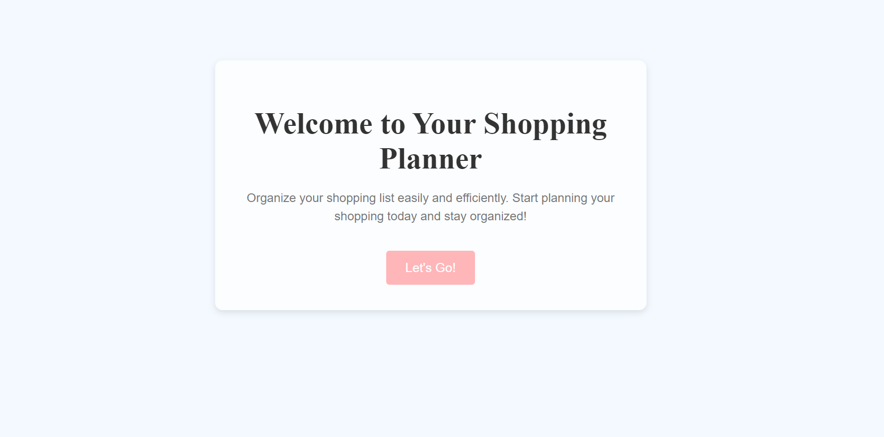
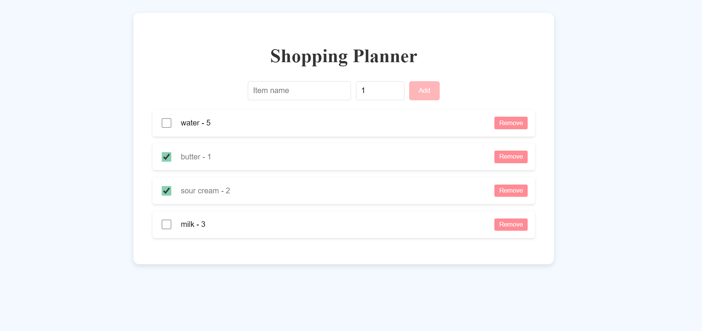
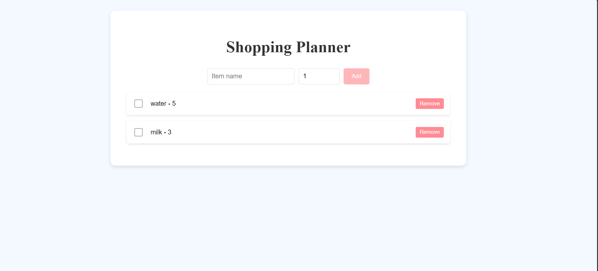

# Shopping Planner

***Shopping Planner*** is a simple shopping list app built with React. It allows users to add items to the shopping list, mark them as bought and remove them. 

## Project description:
The project was created to reinforce basic React skills. It demonstrates working with component state, passing data between components and using localStorage to save data when the page is reloaded.

### Functionality:
- Add items with name and quantity
- Mark items as bought
- Remove items from the list
- Data is saved in **localStorage**

### Technologies:
- **React** —  the main framework for building the user interface
- **CSS** — for styling the application
- **localStorage** — for saving data across page reloads

## Setup Instructions
1. Clone the repository:

```bash
git clone https://github.com/DaryaBelka/shopping-planner.git
```

2. Navigate to the project directory:
```bash
cd shopping-planner
```

3. Install the necessary dependencies:
```bash
npm install
```

4. Start the development server:
```bash
npm start
```

## Screenshots of the app:





